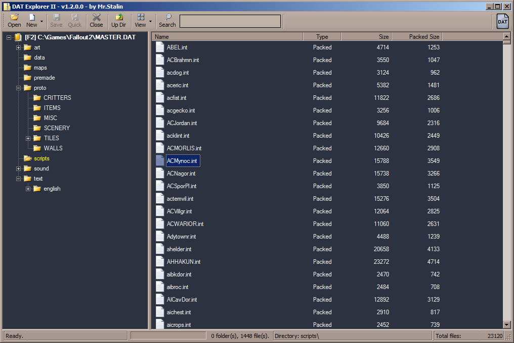

# DAT Explorer II

A utility for viewing the contents of DAT archive files for Fallout 1 and 2, as well as extracting and packing files into them.
This is a replacement for the outdated DAT explorer 1.43 by Dims.

### Features:
- Can associate `.dat` files with the program (open them by double-click).
- Support **Drag&Drop** files from/to the program for quick extraction or adding them to a `.dat` archive.
- Search and open files in a `.dat` archive.

### Limitations:
- The file explorer for the root directory and the desktop is not updated automatically (requires a manual update with the F5 key) when using the Drag&Drop method in Windows 7 (and possibly Windows 10).
- File compression for Fallout 1 DAT format is not supported.

